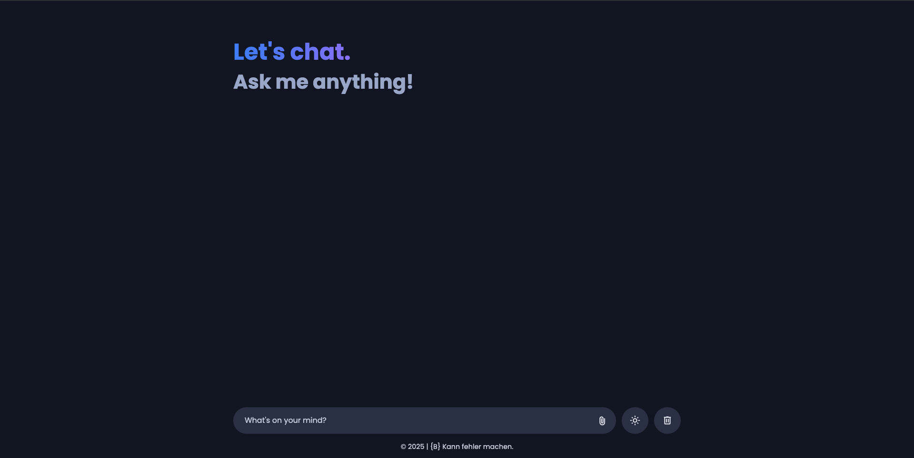

<div align="center">
  <h1>AI Chatbot: Next-Gen Conversational AI Experience</h1>
  <p><strong>Unleashing a new paradigm in shipping with intelligent automation and unparalleled transparency.</strong></p>

  [](https://developer.mozilla.org/en-US/docs/Web/HTML)
  [](https://developer.mozilla.org/en-US/docs/Web/CSS)
  [](https://developer.mozilla.org/en-US/docs/Web/JavaScript)
  [](https://prismjs.com/)
  [](https://developer.mozilla.org/en-US/docs/Web/API/FileReader)
  [](https://ai.google.dev/)

</div>

---

## Welcome to the future of interactive communication.

**{BENTLEY}** is an advanced, innovative, and disruptive conversational AI application that delivers a next-generation chat experience through seamless integration of code intelligence, dynamic file uploads, and adaptive theming. Designed for developers and innovators, this project transforms ordinary chat interfaces into a powerful, multi-functional tool.



---

## Features

- **Real-Time Conversational AI**  
  - Engage instantly with a powerful generative language model that responds intelligently in real time.

- **Intelligent Code Block Handling**  
  - Automatically detects and formats Markdown-style code blocks  
  - Syntax highlighting powered by [Prism.js](https://prismjs.com/)  
  - Includes a one-click “Copy” button for effortless code reuse

- **File Upload & Preview**  
  - Upload images or documents on the fly with instant previews — no page refresh needed

- **Theme Toggle**  
  - Switch between light and dark mode to suit your environment and preference

- **Responsive & Adaptive UI**  
  - Optimized for both desktop and mobile devices with a clean, user-first interface

---

## Tech Stack

- **Frontend:** HTML5, CSS3, Vanilla JavaScript  
- **Syntax Highlighting:** [Prism.js](https://prismjs.com/)  
- **File Handling:** HTML5 FileReader API  
- **AI Integration:** Gemini 1.5 Flash via Google’s Generative Language API  
- **State Management:** In-browser DOM manipulation  
- **Responsive Design:** CSS Flexbox & Media Queries  

---

## Installation

1. **Clone the Repository:**

   ```bash
   git clone https://github.com/sjbentley/LLM-Chatbot.git

    Navigate to the Project Directory:

   cd LLM-Chatbot

Place Your API Key:

The API key and URL are defined in script.js. You can update these values:

```bash
// In script.js
const API_KEY = "YOUR_API_KEY_HERE";
const API_URL = `https://generativelanguage.googleapis.com/v1beta/models/gemini-1.5-flash:generateContent?key=${API_KEY}`;
```
Open the Application:

Simply open index.html in your web browser. Alternatively, you can serve the files using a simple HTTP server:

    npx http-server .

    Then navigate to http://localhost:8080 (or whichever port is shown).


## Project Structure
```bash
/frontend
  ├── index.html         # Main HTML file
  ├── style.css          # Stylesheet for the application
  ├── script.js          # JavaScript code for the chatbot functionality
  ├── favicon/           # Folder containing favicon images
  └── img/               # Folder containing additional images (e.g., avatars, logos)
```

## 🕸️ Snippets

Key snippets from the project will be added here.

## 🔗 Links

- [Project Demo](#) *(Coming Soon)*

## 🚀 More

For further questions or feature requests, open an issue in the repository. 🚀

## License

This project is licensed under the MIT License.

---

[Linktr.ee](https://linktr.ee/sirjahibentley) • [Tiktok](https://tiktok.com/@sirjahibentley) • [Instagram](https://instagram.com/sirjahibentley) • [Facebook](https://facebook.com/sirjahibentley)
